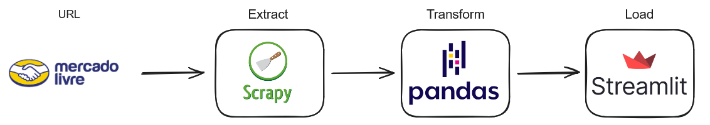

# Web Scrapping Mercado Livre

## Fluxo do Projeto



## Execução

Para rodar o web scraping digite o seguinte comando na pasta transform

```bash
scrapy crawl mercadolivre -o data.jsonl
```

Para rodar o pandas digite o seguinte comando na pasta transform

```bash
python main.py
```

Para rodar o Streamlit digite o seguinte comando na pasta dashboard

```bash
streamlit run app.py 
```

## Insights 

- Qual a quantidade de produtos existentes?
```804 produtos```

- Qual o Preço médio dos produtos?
```R$ 36,12```

- Qual o valor do produto mais caro?
```R$ 990```

- Qual o valor do produto mais barato?
```R$ 8```

